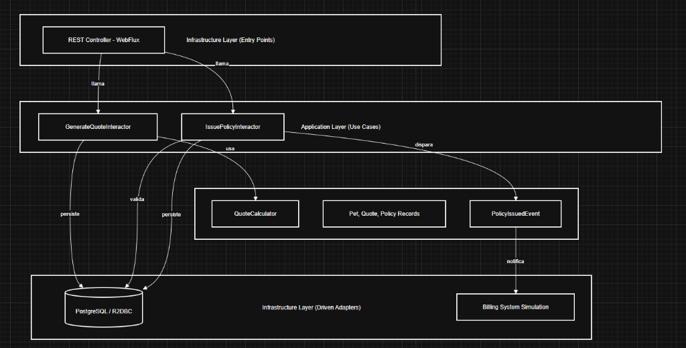
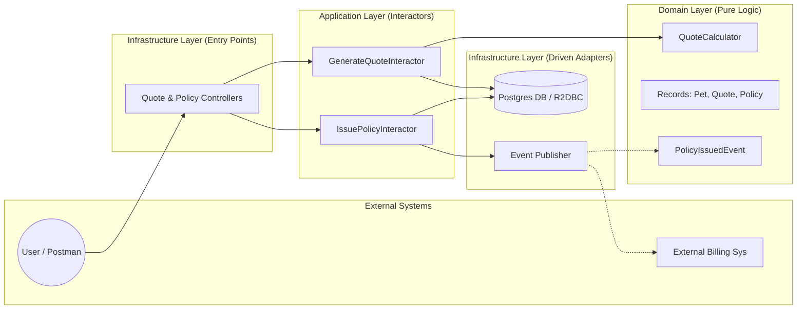

# Arquitectura del Sistema - Pet Insurance

Este proyecto implementa una **Arquitectura Hexagonal (Puertos y Adaptadores)** combinada con principios de **Clean Architecture**, asegurando que el núcleo del negocio sea independiente de frameworks, bases de datos y APIs externas.

## Diagrama de Componentes (Arquitectura Hexagonal)

### Representación en Mermaid (Editable)

## Capas del Sistema

### 1. Capa de Dominio (Domain)
Es el corazón del sistema. Es **100% agnóstica** a Spring u otros frameworks.
- **Modelos**: Records de Java (Pet, Quote, Policy) que representan el estado.
- **Servicios de Dominio**: `QuoteCalculator` contiene las reglas de precios e incrementos de riesgo.
- **Excepciones**: `DomainException` para violaciones de reglas de negocio.
- **Puertos de Salida**: Interfaces que definen cómo el dominio quiere persistir datos o emitir eventos.

### 2. Capa de Aplicación (Application)
Orquesta el flujo de datos hacia y desde el dominio.
- **Interactors/Use Cases**: Implementaciones de los puertos de entrada (`GenerateQuoteUseCase`, `IssuePolicyUseCase`). Manejan la transaccionalidad y la coordinación de servicios.

### 3. Capa de Infraestructura (Infrastructure)
Contiene los detalles técnicos y adaptadores.
- **Entry Points**: Controladores REST reactivos que usan Spring WebFlux.
- **Driven Adapters**: 
    - **Persistence**: Implementación con R2DBC y PostgreSQL.
    - **Events**: Publicación de eventos internos mediante Spring Events (simulando un Message Bus).

## Flujo Reactivo
El sistema es **100% No Bloqueante**. Se utiliza el stack de **Project Reactor** (`Mono` y `Flux`) desde la capa de persistencia hasta el controlador web, permitiendo manejar una alta concurrencia con pocos recursos.
